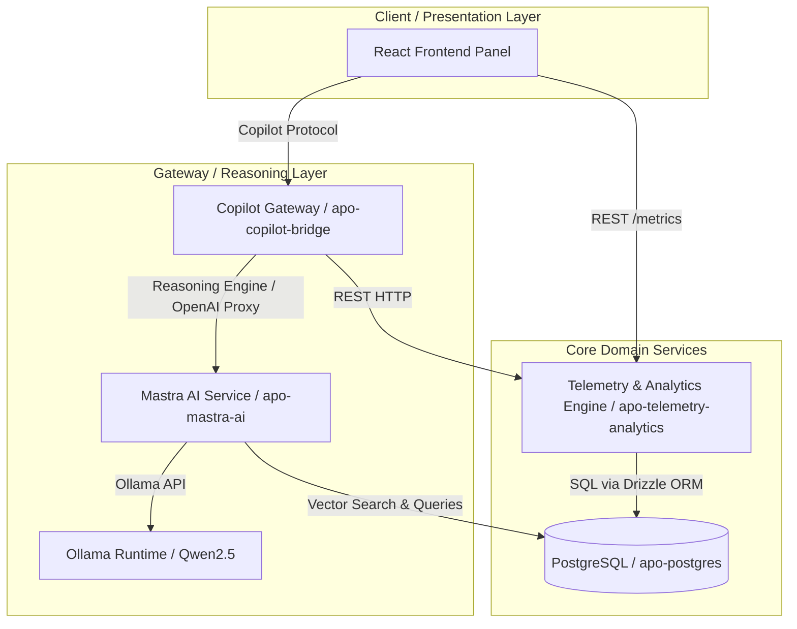

# Multi-Asset Autonomous Paywall Optimizer (APO)

An enterprise-grade, AI-native, and data-reactive microservice platform designed to automate and scale monetization lifecycles across a portfolio of independent mobile applications.

APO acts as an autonomous growth manager: monitoring cohort telemetry across app properties, referencing past mutation success using semantic vector memory, and launching controlled A/B test experiments directly through an interactive Human-in-the-Loop (HITL) control room.

## Core Simulated Scenarios

1. **Multi-App Contextual Awareness**: Simulates Calendar and Fitness Tracker applications running concurrently.
2. **Cross-App User Cohort Overlap**: Seeds 2,000 active users. 200 users are shared across both apps. Purchase actions in one app dynamically decay or boost baseline conversion rates in the other.
3. **Autonomous RAG UI Synthesis**: A telemetry breach (CR < 3%) alerts the user, triggers semantic vector searches via Mastra/pgvector for historical remediation patterns, and proposes optimized paywall layouts.
4. **Controlled A/B Forking**: Deploys the selected variant to a controlled percentage of cohort traffic (using the Copilot-enabled slider) and visualizes the results on a real-time fanned graph.


## UI & Functionality Demo

Watch the [APO UI & Functionality Demo Video](media/video.mov) to see the system in action.

### Screenshots


## System Topology & Architecture

The system is designed using Clean Architecture and Domain-Driven Design (DDD) principles across decoupled service boundaries:



For a comprehensive explanation of our design patterns and layers, see the [architecture.md](file:///Users/bugaro/projects/apo/backend/docs/architecture.md) specification.

---

## Directory Structure

The repository is organized into two primary segments (Frontend and Backend) alongside local infrastructure configuration:

```
apo/
├── README.md                      # Global system overview (this file)
├── hosts.md                       # Service directory and port map
├── frontend/                      # Standalone React + Vite SPA
│   ├── src/                       # Feature-Sliced Design structure
│   │   ├── app/                   # Entry point, providers, and global styling
│   │   ├── pages/                 # Composed views (DashboardPage)
│   │   ├── widgets/               # Business-composed UI blocks (MetricsChart, CopilotSidebar)
│   │   ├── features/              # User-facing business actions (InitiateAbTest)
│   │   ├── entities/              # Core domain state stores (Application, Metrics, Theme)
│   │   └── shared/                # UI kit, API client, logger, and helpers
│   ├── Dockerfile                 # Multi-stage production build (Node + Nginx)
│   └── package.json               # Frontend dependencies and scripts
└── backend/                       # Backend microservices and configuration
    ├── README.md                  # Backend setup instructions and specs
    ├── docs/                      # Technical specifications and design documents
    ├── services/                  # Microservice implementations
    │   ├── telemetry-analytics/   # Core data ingestion, metrics, & user segmentation
    │   ├── copilot-bridge/        # CopilotKit gateway and tool executor
    │   └── mastra-ai/             # Semantic pgvector search & LLM mutation engine
    └── infrastructure/            # Central Docker Compose and observability stack
```

---

## System Requirements

- **Node.js**: `v24.x` or later (for local development, utilizing native TypeScript stripping)
- **Docker & Docker Compose**: For local infrastructure services, databases, and containerized deployment

---

## Tech Stack & Core Services

1. **APO Frontend (Vite + React 19)**:
   - Relies on Feature-Sliced Design (FSD) architecture.
   - Built-in CopilotKit chat sidebar for agent interactions.
   - Integrates Zustand for state management and Recharts for real-time telemetry visualizations.
   - For detailed setup and structure, see the [frontend README.md](file:///Users/bugaro/projects/apo/frontend/README.md).
2. **Telemetry & Analytics Engine (`telemetry-analytics`)**:
   - Hono API service tracking user events (impressions, clicks, purchases).
   - Utilizes RxJS tumbling windows for performant high-velocity event aggregation.
   - Uses deterministic FNV-1a hashing for sticky user segmentation.
   - For endpoints, see the [telemetry-analytics README.md](file:///Users/bugaro/projects/apo/backend/services/telemetry-analytics/README.md).
3. **Copilot Gateway Service (`copilot-bridge`)**:
   - Orchestrates LLM runtime actions via the CopilotKit SDK.
   - Connects the React client with downstream tools for initiating A/B experiments and diagnosing conversion breaches.
   - For configuration details, see the [copilot-bridge README.md](file:///Users/bugaro/projects/apo/backend/services/copilot-bridge/README.md).
4. **Mastra AI Service (`mastra-ai`)**:
   - Integrates the Mastra.ai SDK for agentic execution.
   - Employs pgvector to retrieve historically successful paywall mutations using semantic cosine similarity.
   - Proxies LLM reasoning requests downstream to the Ollama runtime.
   - For reasoning specs, see the [mastra-ai README.md](file:///Users/bugaro/projects/apo/backend/services/mastra-ai/README.md).
5. **Observability Stack**:
   - **OpenTelemetry & Grafana Alloy**: Captures distributed traces across microservice boundaries.
   - **Prometheus & Grafana**: Collects and visualizes real-time performance and cohort metrics.
   - **Grafana Loki**: Aggregates structured logs across all container services.

---

## Getting Started

APO comes with a fully automated bootstrapping container that sets up your environment configuration files and installs dependencies automatically if they are missing.

1. Ensure the Docker daemon is running on your system.
2. From the root directory, navigate to the infrastructure folder and start the services:
   ```bash
   cd backend/infrastructure
   docker compose up -d
   ```
3. **Bootstrapping Process**:
   - The `apo-dependency-check` service runs first. It automatically copies `.env.example` templates to `.env` where needed and installs dependencies for all services.
   - Once it completes successfully, all other services (including postgres databases, Mastra AI, Telemetry, and the Frontend) start.
   - Database migrations are automatically applied, and databases are seeded with 2,000 virtual users (including cross-app cohort overlaps) and RAG vector embeddings.
4. **Accessing the App**:
    - Open your browser to the Frontend UI: `http://localhost:80`
   - View Drizzle Studio for the Telemetry database: `https://local.drizzle.studio?port=4983`
   - View Drizzle Studio for the Mastra vector database: `https://local.drizzle.studio?port=4984`
   - View Grafana metrics dashboards: `http://localhost:3000` (credentials: `admin` / `admin`)

---

