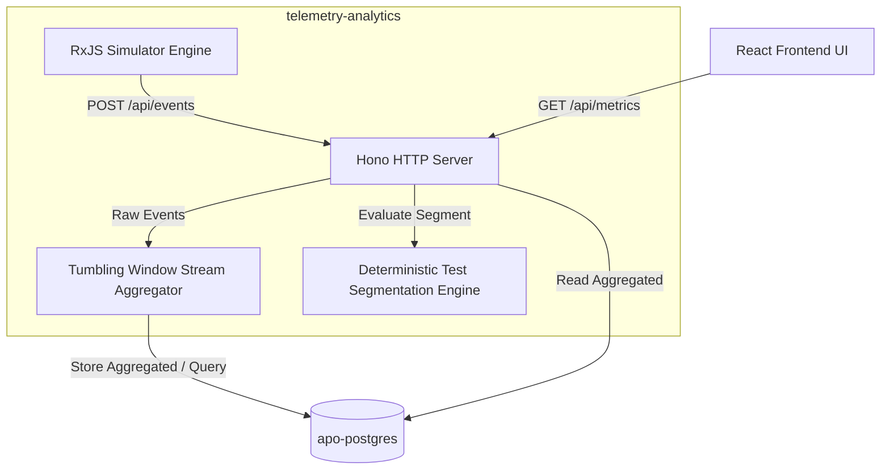

# Product Requirements Document (PRD) — Telemetry & Analytics Service

## 1. Overview & Success Metrics
The **Telemetry & Analytics Service** (`telemetry-analytics`) is the core ingestion, simulation, and real-time computation engine of the Multi-Asset Autonomous Paywall Optimizer (APO). It aggregates user action telemetry (impressions, clicks, purchases) across multiple mobile applications, performs deterministic sample-controlled A/B variant segmentation, and streams tumbling-window metrics to the frontend control room.

### Success Metrics
#### Business KPIs:
- **Segmentation Integrity**: $100\%$ of users deterministic and sticky to their assigned variant (A or B) across sessions.
- **Overlap Behavioral Accuracy**: Overlap user action probabilities shift dynamically based on App A subscription status without state corruption or stale cache reads.
- **Zero Ingestion Drop Rate**: $100\%$ of simulated telemetry events successfully processed and reflected in metrics.

#### Technical KPIs / SLAs:
- **Ingestion Latency**: $\text{P95} \le 20\text{ms}$ for `POST /api/events`.
- **Query Latency**: $\text{P95} \le 100\text{ms}$ for `GET /api/metrics`.
- **Event-Loop Lag**: $\le 10\text{ms}$ sustained during peak simulation loops (2,000 active concurrent simulated users).
- **Buffer Reliability**: Aggregate telemetry events in-memory using RxJS tumbling windows without causing node memory leaks or thread starvation.

---

## 2. User Stories
- **As a Growth Manager**, I want to deploy a controlled A/B test with a defined sample percentage (e.g., $10\%$) on a specific application, so that I can safely test a mutated paywall layout before a full rollout.
- **As a Growth Manager**, I want to see real-time, side-by-side performance metrics of the Control vs. Test variants updated every 5 seconds, so that I can evaluate the conversion lift of my layout hypotheses.
- **As a System Operator**, I want the simulation engine to model realistic cohort overlap behaviors where subscription purchases in App A dynamically decay or boost conversion rates in App B, enabling cross-app LTV evaluation.

---

## 3. Technical Constraints & Domain Modeling

### Microservices & Interactions
- **Context Boundaries**: Decoupled backend container running Hono and TypeScript.
- **Database Dependency**: Interacts with `apo-postgres` via Drizzle ORM.
- **Ingestion & Queries**:
  - `POST /api/events` - Ingests client/simulator telemetry.
  - `GET /api/metrics` - Exposes aggregated metric time series.
- **Simulator Execution**: Run the RxJS simulation loop in a non-blocking context (using throttled pipelines or internal queues) to avoid blocking Hono HTTP worker threads.



### Core Domain
Entities and Value Objects are pure TypeScript structures, independent of frameworks or ORMs.

#### Entities:
- **`Application`**:
  ```typescript
  interface Application {
    id: string;
    name: string;
    createdAt: Date;
  }
  ```
- **`User`**:
  ```typescript
  interface User {
    id: string;
    email: string;
    createdAt: Date;
  }
  ```
- **`ABTest`**:
  ```typescript
  interface ABTest {
    id: string;
    appId: string;
    name: string;
    sampleSizePercent: number; // 0 - 100
    isActive: boolean;
    status: 'draft' | 'running' | 'completed';
    createdAt: Date;
  }
  ```

#### Value Objects:
- **`TelemetryEvent`**:
  ```typescript
  interface TelemetryEvent {
    userId: string;
    appId: string;
    eventType: 'impression' | 'click' | 'purchase';
    variant: 'A' | 'B';
    timestamp: Date;
  }
  ```
- **`CohortOverlap`**:
  ```typescript
  interface CohortOverlap {
    userId: string;
    appId: string;
    appASubscribed: boolean;
    appBSubscribed: boolean;
  }
  ```

#### Domain Events:
- `TelemetryEventIngested` (payload: `TelemetryEvent`)
- `ABTestStarted` (payload: `ABTest`)
- `CohortSubscriptionChanged` (payload: `CohortOverlap`)

### Application / Use Cases
- **`SeedDatabase`**:
  - **Input DTO**: None
  - **Output DTO**: Void
  - **Description**: Triggers seeding of 2 applications, 1,800 exclusive users, and 200 overlap users if the database is uninitialized.
- **`IngestTelemetryEvent`**:
  - **Input DTO**: `{ userId: string; appId: string; eventType: 'impression' | 'click' | 'purchase' }`
  - **Output DTO**: Void
  - **Description**: Resolves user segment/variant and forwards the event to the aggregator.
- **`GetMetrics`**:
  - **Input DTO**: `{ appId: string; since: Date }`
  - **Output DTO**: Array of `{ timestamp: Date; variant: 'A' | 'B'; impressions: number; clicks: number; purchases: number; conversionRate: number }`

#### Ports:
- **`TelemetryRepository`**:
  - `save(event: TelemetryEvent): Promise<void>`
  - `saveBatch(events: TelemetryEvent[]): Promise<void>`
  - `getAggregatedMetrics(appId: string, since: Date): Promise<MetricsSeries[]>`
- **`UserRepository`**:
  - `getById(id: string): Promise<User | null>`
  - `getOverlapUsers(): Promise<CohortOverlap[]>`
  - `updateSubscription(userId: string, appId: string, subscribed: boolean): Promise<void>`
- **`ABTestRepository`**:
  - `getActiveByAppId(appId: string): Promise<ABTest | null>`

### Infrastructure / Database Modeling
PostgreSQL tables mapped via Drizzle:

1. **`applications`**:
   - `id`: `uuid` (Primary Key)
   - `name`: `varchar(255)` (Unique)
   - `created_at`: `timestamp` (Default current)

2. **`users`**:
   - `id`: `uuid` (Primary Key)
   - `email`: `varchar(255)` (Unique)
   - `created_at`: `timestamp` (Default current)

3. **`users_to_apps`**:
   - `user_id`: `uuid` (References `users.id`)
   - `app_id`: `uuid` (References `applications.id`)
   - `app_a_subscribed`: `boolean` (Default false)
   - `app_b_subscribed`: `boolean` (Default false)
   - *Primary Key*: `(user_id, app_id)`
   - *Indices*: Index on `user_id`

4. **`ab_tests`**:
   - `id`: `uuid` (Primary Key)
   - `app_id`: `uuid` (References `applications.id`)
   - `name`: `varchar(255)`
   - `sample_size_percent`: `integer` (0-100)
   - `is_active`: `boolean` (Default false)
   - `status`: `varchar(50)`
   - `created_at`: `timestamp` (Default current)

5. **`telemetry_events`**:
   - `id`: `serial` (Primary Key)
   - `user_id`: `uuid` (References `users.id`)
   - `app_id`: `uuid` (References `applications.id`)
   - `event_type`: `varchar(50)`
   - `variant`: `varchar(10)`
   - `created_at`: `timestamp` (Default current)
   - *Indices*: B-Tree index on `(app_id, created_at)` for optimization of range aggregation queries.

### Hexagonal Architecture Map
- **Domain Layer (`/src/domain`)**: Core entities, value objects, behavior calculation matrix rules. No external dependencies.
- **Application Layer (`/src/application`)**: Boundary use cases, ports (repository interfaces), event dispatchers.
- **Infrastructure Layer (`/src/infrastructure`)**:
  - **`db`**: Drizzle schema definitions, migrations, Postgres adapters.
  - **`http`**: Hono route handlers, payload validation middleware.
  - **`simulator`**: RxJS-driven traffic simulation loops.

---

## 4. Traceability & Observability
- **Correlation ID**: The service intercepts/generates a `X-Correlation-ID` header. This ID must be injected in all logs and downstream calls via Node's `AsyncLocalStorage`.
- **Structured Logging**: All logs must be written to `stdout` as JSON containing `level`, `timestamp`, `message`, `correlationId`, and `serviceContext`.
- **System Metrics**: Expose `/metrics` endpoint for Prometheus scraping. Track connection pool health, event processing queue lengths, and memory allocation.

---

## 5. Acceptance Criteria
### Happy Path:
1. **Db Seeding**: On service boot, if database tables are empty, exactly 2 applications, 1,800 exclusive users, and 200 overlap users must be transactional seeded.
2. **Deterministic Segmentation**: Given an active A/B test with sample size $10\%$, a user ID hashed via `fnv1a(userId + testId) % 100` resulting in $< 10$ must consistently receive Variant B, and Variant A otherwise.
3. **Cross-App Overlap Behavior**: Overlap users who purchase a subscription in App A (`app_a_subscribed` becomes `true`) will trigger a multiplier boost/decay of $+25\%$ conversion rate in App B events inside the simulator engine.
4. **Buffered Metric Aggregation**: Simulated events are aggregated in-memory in 5-second tumbling windows and saved to `telemetry_events` in bulk, allowing `GET /api/metrics` to return up-to-date statistical graphs.

### Negative Scenarios:
1. **Database Connection Interruption**: If the DB drops during a simulation batch save, the aggregator must retry up to 3 times with exponential backoff before logging a critical error.
2. **Invalid Telemetry Request Payload**: `POST /api/events` returns `400 Bad Request` if `userId` or `appId` are malformed UUIDs.
3. **Zero Active A/B Tests**: If no active tests exist for an application, $100\%$ of users must default to Variant A without processing hash computations.

### Performance SLAs:
- **Endpoint `POST /api/events`**: Response latency $\le 20\text{ms}$ at $\text{P95}$.
- **Endpoint `GET /api/metrics`**: Response latency $\le 100\text{ms}$ at $\text{P95}$.

---

## 6. TASK_LIST

- [ ] **TASK: telemetry-analytics/src/infrastructure/db/schema.ts** | Define Drizzle database tables, fields, composite keys, and indices. | Schema compiles. Correct columns and references mapped.
- [ ] **TASK: telemetry-analytics/src/infrastructure/db/seed.ts** | Write transaction-wrapped database seeding logic for 2 apps, 1,800 exclusive users, and 200 overlap users. | Tables populated with correct ratios when empty. No duplicates.
- [ ] **TASK: telemetry-analytics/src/domain/segmentation.ts** | Implement deterministic segmentation engine utilizing `fnv1a(userId + testId) % 100`. | Unit tests verify uniform distribution and absolute stickiness.
- [ ] **TASK: telemetry-analytics/src/infrastructure/simulator/traffic-simulator.ts** | Build the RxJS traffic simulator loops with tickers and probability matrices (including overlap subscription multipliers). | Simulator runs in separate context. Event loop lag $\le 10\text{ms}$.
- [ ] **TASK: telemetry-analytics/src/infrastructure/http/server.ts** | Setup Hono server routes (`GET /api/metrics`, `POST /api/events`), validation middleware, and Correlation ID middleware. | HTTP API responds according to SLAs; correlationIds logged.
- [ ] **TASK: telemetry-analytics/src/application/use-cases/metrics-aggregator.ts** | Implement RxJS `bufferTime(5000)` tumbling window logic and batch database inserts. | High write load handled smoothly. No event loss on DB transient error.
- [ ] **TASK: telemetry-analytics/tests/e2e.test.ts** | Write Playwright/Vitest end-to-end integration tests validating simulation boot, seeding, segmentation, ingestion, aggregation, and querying. | Complete flow executes successfully under continuous traffic.
