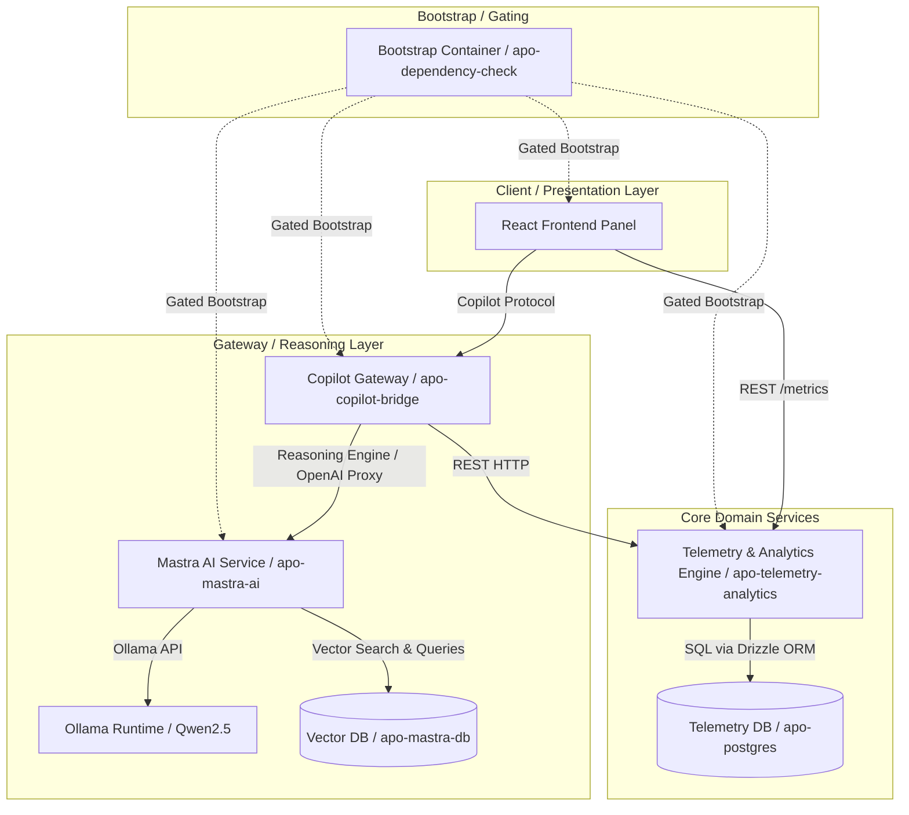

# Architecture & Technical Stack

The Multi-Asset Autonomous Paywall Optimizer (APO) backend is built following the principles of **Clean Architecture** and **Domain-Driven Design (DDD)**. This directory documents the system design, components, and communication protocols.

## System Topology

The system consists of decoupled microservice and storage boundaries that communicate over a local virtual bridge network (Docker Network):



### Centralized Dependency Bootstrapping
To guarantee environment reliability and clean setup, a dedicated orchestration container (`apo-dependency-check`) operates as a startup gate. On boot, this container:
1. Copies global and service-specific environment template files (`.env.example`) to their active configuration targets (`.env`) if missing.
2. Checks for the presence of `node_modules` directories in all service paths.
3. Automatically runs `npm install` for any service missing its dependencies before terminating successfully, allowing dependent services to start.

---

## Architecture of `telemetry-analytics`

The `telemetry-analytics` service is structured into three main layers:

### 1. Domain Layer (`src/domain`)
The core domain logic is framework-agnostic and relies only on pure TypeScript structures:
- **Entities**: Represents business concepts like `Application`, `User`, and `ABTest`.
- **Value Objects**: Structs like `TelemetryEvent` and `CohortOverlap` that are defined by their attributes.
- **Domain Services**: Functions such as `evaluateSegment` which uses deterministic FNV-1a hashing to sticky assign users to A/B test variants:
  - Users are bucketed using `hash(userId + testName) % 100`.
  - If the bucket is less than the test's `sampleSizePercent`, they receive the **Test** variant (`B`); otherwise, they receive the **Control** variant (`A`).

### 2. Application Layer (`src/application`)
Defines the business use cases and orchestrates the flow of data:
- **Ports**: Interface contracts for databases, repositories, and external aggregators (e.g., `UserRepository`, `TelemetryRepository`, `ABTestRepository`).
- **Use Cases**:
  - **`MetricsAggregator`**: Accumulates events in memory and processes them using RxJS tumbling windows (defaulting to 5-second tumbling buckets) to calculate real-time conversion rates and impressions. This prevents database write bottlenecking and handles high-velocity telemetry streams.

### 3. Infrastructure Layer (`src/infrastructure`)
Implements the adapters for databases, networks, and protocols:
- **HTTP Server**: Powered by Hono, running natively on Node 24 with native TypeScript execution.
- **Database**: PostgreSQL with Drizzle ORM for schema validation, migration, and query execution.
- **Simulator**: An RxJS-based Traffic Simulator that models virtual user behaviors, including cross-app cohort overlapping, purchase decays, and boost behaviors.

---

## Architecture of `mastra-ai`

The `mastra-ai` service operates as the RAG (Retrieval-Augmented Generation) and reasoning core. It is built using the same Clean Architecture layout as the analytics engine:

### 1. Domain Layer (`src/domain`)
Encapsulates service boundaries, data schemas, and invariants:
- **Entities & Schemas**: Defines `AbHypothesisSchema` (validating structured LLM suggestions) and `MutateRequestSchema` (HTTP request payload schema).
- **Constants**: Houses fallback configurations (such as fallback price points and CTA texts), SLA thresholds (such as LLM timeouts of 4500ms), and Ollama model configuration defaults (e.g. `qwen2.5:3b` generation model, `all-minilm` embedding model).

### 2. Application Layer (`src/application`)
Delineates the business logic flow and separates orchestrations from external drivers:
- **Ports**: Defines contract boundaries for vector search and LLM operations (`VectorStorePort`, `EmbeddingPort`, `LlmReasoningPort`).
- **Use Cases**:
  - **`GenerateRemediationProposal`**: Orchestrates the core reasoning workflow. When an optimization request is received, it constructs a descriptive failure string, invokes the embedding port, retrieves similar past mutations from the vector store via pgvector (RAG), and calls the LLM with the grounding facts. It enforces execution timeouts, handles fallback defaults on failures, and maps findings to a uniform API schema.

### 3. Infrastructure Layer (`src/infrastructure`)
Hosts third-party drivers, database scripts, and adapters:
- **HTTP Server**: Powered by Hono and @hono/node-server running natively on Node 24.
- **OTel SDK Bootstrap**: Bootstraps tracing metrics using the OpenTelemetry SDK (must be loaded as the first import to patch raw http modules).
- **Vector Store Adapter**: Implements `VectorStorePort` using pgvector and Drizzle ORM to perform cosine distance semantic similarity queries.
- **Ollama LLM Adapter**: Connects to the local Ollama daemon to extract text embeddings and request JSON-structured LLM completions.
- **OpenAI-Compatible Ollama Proxy**: Hosts a lightweight OpenAI API reverse proxy (`/api/reasoning/openai/*`) routing chat completion and configuration requests directly to Ollama.

---

## Architecture of `apo-frontend`

The `apo-frontend` is a single-page application (SPA) built with Vite + React 19 + TypeScript, organized using **Feature-Sliced Design (FSD)** for modular domain boundaries.

### 1. Shared Layer (`src/shared`)

Reusable infrastructure and UI primitives:
- **API Client (`shared/api`)**: Typed fetch wrapper with `X-Correlation-ID` propagation, request timeout (5s), and structured error classes (`ApiError`, `ValidationError`).
- **UI Kit (`shared/ui`)**: Design system primitives — `Button`, `Slider`, `Card`, `Spinner`, `ErrorBoundary` — built with the compound component pattern and full a11y support.
- **Lib (`shared/lib`)**: Structured JSON logger (`logger`) and centralized constants (`constants.ts`) for polling intervals, timeouts, localStorage keys, and HTTP status codes.

### 2. Entities Layer (`src/entities`)

Domain models with Zustand stores:
- **`application`**: `Application` type + `useAppStore` — persists active app to `localStorage`, provides mock app list (Calendar, Fitness Tracker).
- **`metrics`**: `MetricWindow` type + `useMetricsStore` — real-time polling via `GET /api/metrics`, stale data detection, race-condition guard via `isFetching` flag.
- **`experiment`**: `Experiment` / `AbExperimentPayload` types + `useExperimentStore` — create experiment via `POST /api/experiments`, duplicate-submission guard, experiment list management.

### 3. Features Layer (`src/features`)

User-facing business actions:
- **`initiate-ab-test`**: `ExperimentForkSlider` — sample-size slider (1-99%) + deploy button, connected to `useExperimentStore.createExperiment`.

### 4. Widgets Layer (`src/widgets`)

Composed UI blocks combining features and entities:
- **`metrics-chart`**: `MetricsChart` — real-time metric grid with loading, empty, error, stale, and data states; memoized metric aggregation per variant.
- **`app-selector`**: `AppSelector` — dropdown/display for multi-app or single-app mode.
- **`copilot-sidebar`**: `CopilotSidebar` — placeholder shell for CopilotKit integration.

### 5. Pages Layer (`src/pages`)

Composition root:
- **`dashboard/DashboardPage`**: Orchestrates all widgets, reads `activeAppId` from `useAppStore`, wrapped in `ErrorBoundary`.

### 6. App Layer (`src/app`)

Entry point and global setup:
- **`main.tsx`**: Mounts React root with `StrictMode` and top-level `ErrorBoundary`.
- **`index.css`**: Dark-theme CSS custom properties, reset, and utility classes.

### Communication Diagram

```
apo-frontend (:5173 dev / :80 prod)
  │
  ├── REST (JSON) ──────────► apo-telemetry-analytics (:4003)
  │     GET  /api/metrics?appId={id}
  │     POST /api/experiments
  │
  └── CopilotKit Runtime ───► copilot-bridge (:4005)
        POST /copilot/chat
```

---

## Developer GUI Tools

To facilitate local inspection of database states, the environment runs two browser-based Drizzle Studio instances:
- **Drizzle Studio (Telemetry)**: Accessible at `https://local.drizzle.studio?port=4983`. It connects to the `apo-postgres` container to inspect user logs, cohort structures, and events.
- **Drizzle Studio (Mastra AI)**: Accessible at `https://local.drizzle.studio?port=4984`. It connects to the `apo-mastra-db` container to examine RAG vector memory embeddings and historical paywall mutations.

Both studios automatically rebuild `esbuild` configurations on startup to ensure instant local availability.

---

## Observability & Telemetry

APO leverages a modern observability stack for distributed tracing, log aggregation, and metric monitoring:
- **Distributed Tracing (OpenTelemetry)**: Decoupled services (`copilot-bridge`, `mastra-ai`, `telemetry-analytics`) run a side-effect `otel` bootstrap script. This script registers the OpenTelemetry `@opentelemetry/sdk-node` NodeSDK and `HttpInstrumentation`, capturing HTTP requests and propagating context headers. Spans are batched and exported via OTLP/gRPC to **Grafana Alloy** (listening on port `4317` on the docker network), enabling full trace visualization across microservice boundaries.
- **Metrics (Prometheus)**: Prometheus scrapes real-time application and Node runtime metrics from the `/metrics` HTTP endpoints.
- **Log Aggregation (Grafana Loki & Alloy)**: **Grafana Alloy** acts as a log forwarding agent. It captures structured JSON logs written to container `stdout` by Pino and ships them to **Grafana Loki**.
- **Correlation Tracking**: Propagates `x-correlation-id` headers through an `AsyncLocalStorage` context, linking incoming REST requests, database queries, and async task loops.
- **Grafana Dashboard**: Visualizes real-time performance graphs, request rates, latency histograms, and A/B test cohort metrics in a unified panel.
